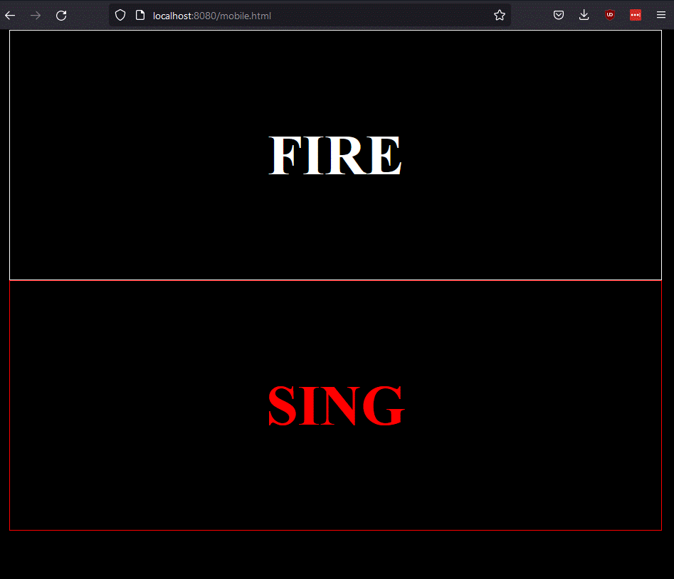

# Pirate Automation

This system is used to coordinate and control the pirate props. 

## Requirements
### Hardware
- Python 3.8 or higher
- Ethernet (wifi or wired)
- GPIOs

For prop control itself this makes embedded linux maker boards like The Raspberry Pi or Beaglebone black perfect candidates
Given the loosely coupled architecture, logic can be tested on one system and moved to another at will.


## Installing
install global requirements through pip via:
`pip install -r requirements.txt`
(pip3 may be required depending on your default python install)

You may need to intall the Adafruit GPIO library depending on your platform

Raspberry Pi: `sudo pip3 install RPI.GPIO`

Beaglebone Black: `sudo pip3 install Adafruit_BBIO`

## Running
`python3 ./crewmates/main_deck.py`

Then on the same local network (can even be the same host, especially for testing), run a prop script directly
i.e.:
`python3 ./crewmates/cannon.py`

the main deck log should look something like this

```commandline
AVAST! NEW SHIP IN HARBOR ->  192.168.1.176
AHOY ->  192.168.1.176
('192.168.1.176', 55097) Permission to board?
{'type': 'SA', 'address': 'CANNON'}
{'type': 'S', 'address': 'CANNON'}
```

and the log from the crewmate should look something like:
```commandline
on BBB
registering firing
registering jammed
registering loading
~LFC~
AHOY ->  192.168.1.128
WELCOME ABOARD ->  192.168.1.176
Boarding the good ship: ws://192.168.1.176:31337
```

## User Interface
Run server.sh to launch a simple HTTP server that hosts the user interface and other assets.

captain.html includes a drag-and-droppable UI to help visualize prop placement and current status of props.


mobile.html includes a simplified command menu for quick actions during Halloween. 


## Architecture
The achitecture is standard Pub/Sub message passing. All classes and concepts use nautically themed names. 
(E.g. the broker is "the main deck", clients are "crewmates", connection announcements use "AHOY", etc)

Each prop has its own python class to control the actual thing. It discovers the main deck using UDP multicast and establishes a websocket connection.
command messages can be sent by any crewmate (UI or other prop) and are handled through the handle_command() method. Dynamic propeties are constructed through CrewmateProperty() 
and when assigned to automatically send a notification message that can be subscribed to by other crewmates. See the "cannon.py" crewmate file for a simple example.

asyncio is used for cooperative multi-tasking. This is preferred over threading due to limited CPU on the target systems, the ease of determining order of operations and to avoid the need to lock or worry about GIL.

The user interface is standard Javascript. It uses websockets to connect to the "main deck" the same as python crewmates and fabric.js to draw on the canvas.


### Message Types
See util.py for the message types and keys. 


## Tips
### Run the script on boot
use `sudo crontab -e` for example:
```
# m h  dom mon dow   command
@reboot python3 /home/debian/Pirates/Helm/crewmates/cannon.py &
```
Note: This not work for media based props (e.g. projectors)

If that doesn't work for projection/video you can also try adding a .desktop file to ~/.config/autostart
for example the following file is /home/pi/.config/autostart/pumpkins.desktop
```
[Desktop Entry]
Type=Application
Name=Pumpkins
Comment=
Exec=vlc --extraintf=http --http-host 0.0.0.0 --http-port 8080 --http-password x --play-and-pause --fullscreen
Terminal=false
Hidden=false
```

### RPI servo hat requirements

If you're running the sero hat you'll need install the following:

```
sudo apt-get install -y python-smbus
sudo apt-get install -y i2c-tools
sudo pip3 install adafruit-circuitpython-servokit
```

You will also need to enable i2c via `sudo raspi-config` and reboot
see [the tutorial](https://learn.adafruit.com/adafruit-16-channel-pwm-servo-hat-for-raspberry-pi/overview) for more info